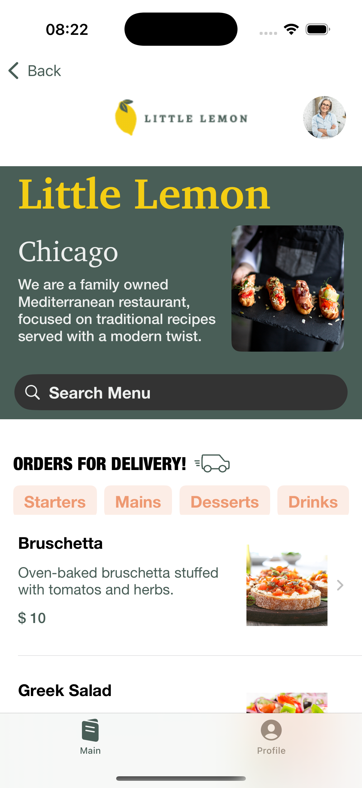

# Little Lemon Food Ordering App
This is the capstone project for the Meta iOS Developer Professional Certificate program. The project was to create a mobile iOS app for the Little Lemon restaurant 
showing a login screen to list menu items and provide a profile view to store preferences of the User like email, phone number, and notifications.

## Preview
   

## Features
- Onboarding screen that prompts users to enter name and email.
- Navigation Stack to move between screens.
- Home screen features multiple views (header, hero, order section, and menu selection.
- Profile screen stores the customer's information and allows for changes to name, email, phone number, notification preferences, and logout.
- Menu list allows for search, filtering, and links to a full screen detail for the item.

## Wireframe, Branding, and UI Design
Figma was used to produce wireframe, UI design, and branding.

 

## Getting Started
To run the application you will need to install or have [XCode](https://developer.apple.com/documentation/safari-developer-tools/installing-xcode-and-simulators) on your machine and clone the repo to run in a simulation. This project was made for the educational purpose 
of the program and does not have all functionality of buttons or actual notifications in place as these were outside of the scope required for this project.
